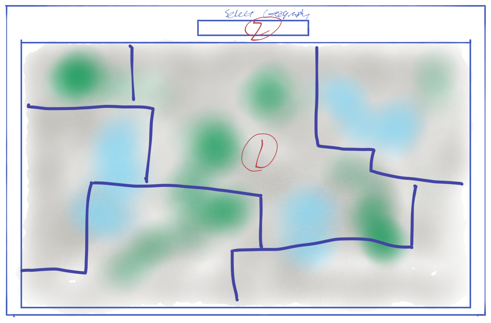

#### Neighborhood Nexus: Assistant Full Stack Developer Orientation
## Exercise 2: Map Makinhg

### Description
The purpose of this exercise is to demonstrate simple map making using [React-Leaflet.js](https://react-leaflet.js.org/)  and the ability to use the React Hooks ```useState()``` and ```useEffect()``` to dynamically render GeoJSON returned via API.  The final result should be a working single page application which allows the user to select a map geography to be dislpayed on full page map.

### Getting Started
1. Clone repo to your a local directory.
2. Create a new branch called "[Your Name]"
3. Run ```npm install```
 
### Template and Instructions for Development

1. Map Container 
    * Import ```MapContainer```,  ```TileLayer``` and ```GeoJSON``` components from ```react-leaflet``` npm package.
    * Nest  ```TileLayer``` and ```GeoJSON``` within  ```MapContainer```
    * Import ```config``` from  ```./config.json``` and use to set:
      * ```center``` and ```zoom``` props in ```<MapContainer />```
      * ```url``` and ```attribution``` props in ```<TileLayer />```
    * Get ```geoJSON``` via API call (see below) and use to set ```data``` props in ```<GeoJSON />```
2. Geography Selector
     * Import and use ```<Dropdown selection/>``` component from ```semantic-ui-react``` npm package.
     * Get options params from imported ```config``` object and create option array to pass to options in ```<Dropdown />```
     * Selecting a geography should ```setSelectedGeo``` to be used to ```getGeoJSON```.
     *  ```getGeoJSON``` should use ```url``` value passed from ```selectedGeo``` to run API call and ```setGeoJSON``` using ```data``` proporty in response which should in turn add/change ```<GeoJSON />``` component to the map


